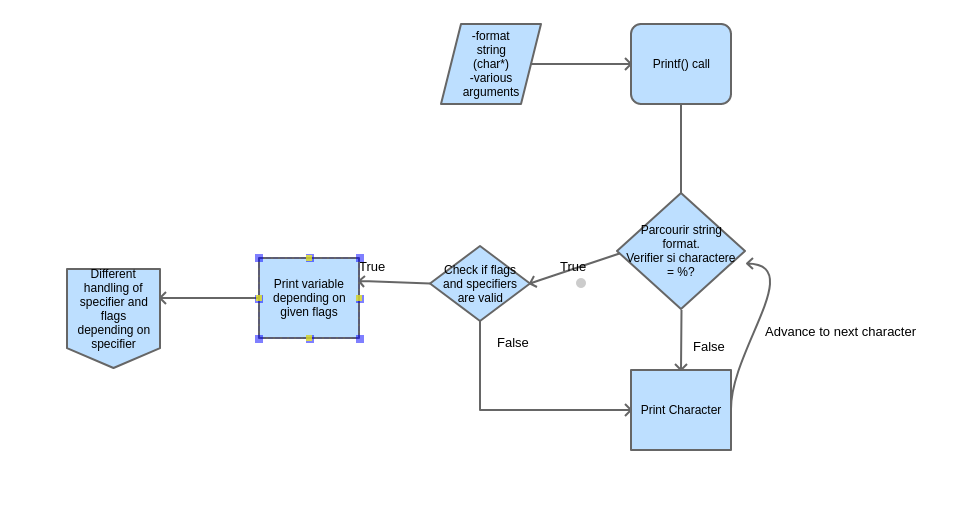

<!DOCTYPE html>
<html lang="en">
  <head>
    <meta charset="UTF-8" />
    <meta http-equiv="X-UA-Compatible" content="IE=edge" />
    <meta name="viewport" content="width=device-width, initial-scale=1.0" />
  </head
      <h1 style="color: crimson;text-align: center;"> Write our own _printf</h1>
        
## Theory and Practice

- Stéphanie Metche Serpault Directrice Holberton School Toulouse at Salon de l Etudiant with

- Nicolas Bouté
- Siham Badyine

 

* [Introduction](#introduction)
* [Steps](#steps)
* [Flowchart](#flowchart)
* [Ressources](#learning)
* [Usage](#usage)
* [Testing](#tests)

## Introduction

This project _printf function in C, is our first collaborative
work in programming at Holberton School.

It will permit us to understand well variadic functions in C.

Our secret for the _printf project is a well-structured departure
We have solved problems before start coding to know exactly what are we going to code.

Then, start coding this project on the way Paris/Toulouse the 11th of March 2022
In the train for reach, le "Salon de l'etudiant 2022 " to represent Holberton School and share our passion with futur students visiting the Salon Studyrama.
  
 

## Steps

First of all, we drawn a flowchart
This allows us for a more global vision and to record tasks more quickly

## Flowchart

 

## Those are the format identifiers needed to write:

%  | type |
---|------|
%c | character				|
%s | string					|
%p | pointer				|
%d | decimal signed integer	|
%i | integer				|
%u | unsigned integer		|
%x | hex integer (lowercase)|
%X | hex integer (uppercase)|
%% | just the %				|

## We handle in this project
--- the flags:
--- the field width
--- the precision
--- the length modifiers
--- and custom conversion specifiers

## Integers

## Decimal to hexadecimal conversion

## Ressources

* [_printf overview]()
* [secrets of printf](<a href="Ressources/The_Secret.pdf">)

## Usage
  Have a look at our [documentation](./man_3_printf)
  Feel free to clone or fork this repository, if you have any problem 
  you can contact us.

## Learn more 
  write in your terminal 
 `$ man 3 printf`.

## Tests

<footer>
 

  

<a class="badge-base__link LI-simple-link" href="https://fr.linkedin.com/in/nicolas-bout%C3%A9-0192b2112?trk=profile-badge">Nicolas Bouté</a>

<a class="badge-base__link LI-simple-link" href="https://fr.linkedin.com/in/siham-b-523a36230?trk=profile-badge">Siham B.</a>

              

visit our profiles

 

</footer>

</body>
</html>
